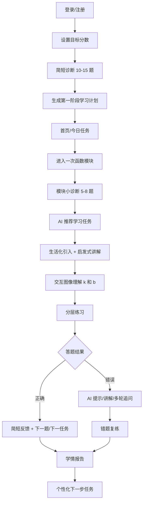
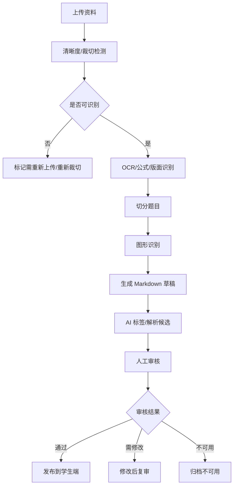

# 初中 AI 学习软件 MVP 原型流程设计

日期：2026-06-30

## 1. 原型目标

本原型设计服务于一次函数 MVP，目标是验证学生端学习闭环和后台审核流程是否清楚、可执行、可开发。

原型阶段不追求高保真视觉风格，先明确：

- 学生从进入系统到完成一次函数任务的完整路径。
- AI 教练在每个关键节点如何介入。
- 语音、文字、公式、图像如何共同服务数学学习。
- 后台如何导入、识别、审核和发布题目。
- 哪些页面属于 MVP，哪些能力只预留。

## 2. 信息架构

### 学生端

1. 登录与学习档案。
2. 目标设置与简短诊断。
3. 首页 / 今日任务。
4. 数学模块选择。
5. 一次函数模块页。
6. 一次函数模块小诊断。
7. 学习任务页。
8. 一次函数交互图像组件。
9. 练习页。
10. AI 讲解与多轮追问。
11. 错题复盘页。
12. 学情报告页。

### 后台端

1. 资料导入页。
2. 导入任务详情页。
3. 题目审核页。
4. 图形识别审核页。
5. 知识内容管理页。
6. 发布控制页。

## 3. 学生端主流程



## 4. 页面原型说明

### 4.1 登录与学习档案

页面目标：

- 让学生快速进入系统。
- 建立可持续保存的学习档案。

关键区块：

- 登录方式：手机号/验证码或账号密码。
- 学生基础信息：昵称、年级、地区可选。
- 学习档案提示：说明系统会保存目标、诊断、错题和任务进度。

主要操作：

- 登录。
- 新用户进入目标设置。
- 老用户进入首页。

状态：

- 未登录。
- 新用户未设置目标。
- 老用户已有学习计划。

### 4.2 目标设置与简短诊断

页面目标：

- 用轻量方式建立个性化学习起点。
- 避免一开始给学生过重测试压力。

关键区块：

- 目标分数选择：80、100、110+、满分冲刺。
- 当前自评：基础薄弱、一般、想冲高分。
- 诊断说明：约 10-15 题，预计 10 分钟。
- 开始诊断按钮。

诊断页结构：

- 顶部进度：第 N / 15 题。
- 题目区域。
- 答题区：选择、填空或简短过程。
- 语音输入按钮：用于说思路，不替代最终答案。
- 提交按钮。
- 暂不确定按钮：记录为低信心作答。

诊断完成反馈：

- 当前目标。
- 初步水平判断。
- 优先建议模块。
- 第一阶段学习计划入口。

### 4.3 首页 / 今日任务

页面目标：

- 让学生一打开就知道今天该学什么。
- 用低压力方式展示进步和任务。

关键区块：

- 今日推荐任务卡。
- 一次函数学习进度。
- 薄弱点提醒。
- 错题复练提醒。
- 轻量激励：连续学习、掌握度提升、错题复练通过。
- AI 学习教练入口。

今日任务卡内容：

- 推荐原因。
- 任务名称。
- 预计时长：10 / 20 / 40 分钟。
- 完成标准。
- 开始按钮。

示例：

```text
推荐任务：理解一次函数中 k 的意义
原因：你在图像增减性题上连续错了 2 次
预计：20 分钟
完成标准：完成 1 个讲解、4 道练习、1 次复盘
```

### 4.4 数学模块选择

页面目标：

- 保留学生自主选择权。
- 同时让 AI 推荐不会被忽略。

关键区块：

- 数与式。
- 方程与不等式。
- 函数。
- 图形与几何。
- 统计与概率。

模块卡片信息：

- 学习状态：未开始、学习中、需复习。
- AI 推荐标记。
- 推荐原因。
- 当前掌握度。

MVP 状态：

- 函数模块可进入。
- 其他模块可展示为后续扩展，不做完整学习闭环。

### 4.5 一次函数模块页

页面目标：

- 展示一次函数学习地图。
- 引导学生先做模块小诊断。

关键区块：

- 模块概览：为什么学一次函数。
- 生活场景入口：打车费、手机套餐、路程时间、方案比较。
- 知识点路径：
  - 变量与函数关系。
  - 正比例函数。
  - 一次函数表达式。
  - `k`、`b` 与图像。
  - 求解析式。
  - 图像读信息。
  - 应用建模。
  - 交点与方案比较。
- 模块小诊断入口。
- AI 推荐学习任务。

交互规则：

- 默认建议先做小诊断。
- 学生可跳过，但 AI 需要提示可能影响推荐准确性。

### 4.6 学习任务页

页面目标：

- 承载一个 10/20/40 分钟学习任务。
- 把生活化引入、启发式讲解、图像互动和练习串起来。

布局建议：

- 顶部：任务标题、预计时间、进度。
- 左侧或主区域：学习内容。
- 右侧或下方：AI 教练对话区。
- 底部：继续、请求提示、语音输入、播放讲解。

任务结构：

1. 生活场景。
2. AI 引导问题。
3. 数学抽象。
4. 交互图像。
5. 例题拆解。
6. 即时练习。
7. 小结。

示例任务：

```text
任务：从打车费理解 y = kx + b
生活问题：起步价 10 元，超过 3 千米后每千米 2 元，费用如何随里程变化？
引导问题：哪些量在变化？哪个费用是不变的？哪个费用会随着路程增加？
数学抽象：y = 10 + 2(x - 3)
中考连接：这类题常考固定费用和变化费用的区分。
```

### 4.7 一次函数交互图像组件

页面目标：

- 让学生直观看到 `k`、`b` 对直线的影响。

核心区域：

- 坐标系。
- 直线图像。
- `k` 滑块。
- `b` 滑块。
- 当前表达式：`y = kx + b`。
- 关键观察提示。

交互状态：

- 拖动 `k`：直线斜率变化，旁边提示“k > 0 时，x 增大，y 增大”。
- 拖动 `b`：直线上下平移，旁边提示“b 是直线与 y 轴的交点纵坐标”。
- 点检测：输入点坐标，系统判断是否在直线上。
- 双方案比较：显示两条直线和交点。

语音支持：

- 学生可问：“为什么 k 变大直线更陡？”
- AI 可语音讲解，同时文字保留在旁边。

MVP 边界：

- 做交互理解。
- 不做学生手动画图批改。

### 4.8 练习页

页面目标：

- 支持学生完成分层练习。
- 在练习中控制 AI 给答案的节奏。

布局建议：

- 顶部：题目进度、难度、能力标签。
- 主区域：题干、题图、选项或输入框。
- 作答区：最终答案、可选步骤。
- 语音区：说出思路。
- AI 帮助区：提示模式、讲解模式、答案模式。

题型支持：

- 选择题。
- 填空题。
- 解答题。

AI 帮助规则：

- 未提交答案前默认提示模式。
- 提交后开放讲解模式。
- 答案模式建议在多次求助或提交后开放。

错误状态：

- 答案错误。
- 步骤缺失。
- 图像理解错误。
- 建模错误。
- 计算错误。

### 4.9 AI 讲解与多轮追问页

页面目标：

- 让学生知道自己错在哪里，并能继续追问。
- 支持文字和语音双通道。

布局建议：

- 左侧：原题、学生答案、学生步骤。
- 中间：AI 讲解流。
- 右侧：错因标签、同类题建议。

讲解结构：

1. 先复述学生思路。
2. 定位关键错误。
3. 给第一步提示。
4. 学生可继续回答或追问。
5. 必要时给完整规范解法。
6. 推荐同类题或复练任务。

输入方式：

- 文字追问。
- 语音追问。
- 快捷问题：
  - 为什么这一步错？
  - 有没有更简单方法？
  - 这类题怎么判断？
  - 给我一道相似题。

### 4.10 错题复盘页

页面目标：

- 把错题从“看解析”变成“再理解、再练会”。

关键区块：

- 错题列表。
- 错因分类。
- 是否已复练通过。
- AI 复盘入口。
- 相似题推荐。

错题卡片内容：

- 题目摘要。
- 错因。
- 关联知识点。
- 首次错误时间。
- 最近复练状态。

### 4.11 学情报告页

页面目标：

- 给学生可理解、可行动、不过度焦虑的反馈。

默认展示：

- 本次完成情况。
- 进步点。
- 当前最薄弱的 1-3 个点。
- 主要错因。
- 下一步任务。

展开内容：

- 知识点掌握度。
- 能力类型表现：概念、表达式、图像、应用、综合。
- 难度层级表现：基础、提升、冲刺。
- 错题再练通过率。
- 近 7 天变化。

报告语气：

- 先肯定具体进步。
- 再指出最关键问题。
- 最后给明确下一步。

示例：

```text
你今天完成了 8 道一次函数练习，图像读信息比上次稳定。
现在最需要加强的是“应用建模”：你容易把固定费用和变化费用混在一起。
下一步建议：完成 3 道打车费/套餐比较题，预计 10 分钟。
```

## 5. 后台端主流程



## 6. 后台页面原型说明

### 6.1 资料导入页

页面目标：

- 支持 Word、PDF、扫描图片、Markdown 导入。
- 让后台人员看到处理进度和失败原因。

关键区块：

- 上传入口。
- 文件列表。
- 处理状态。
- 错误提示。
- 进入审核按钮。

状态：

- 待识别。
- 识别中。
- 识别失败。
- 待审核。
- 已发布。

### 6.2 导入任务详情页

页面目标：

- 查看一次导入中识别出的题目。
- 快速定位低置信度题目和图形题。

关键区块：

- 原文件预览。
- 题目切分列表。
- OCR 质量评分。
- 图形识别置信度。
- 批量操作：进入审核、标记不可用、重新识别。

### 6.3 题目审核页

页面目标：

- 审核和修正题目结构化内容。

布局建议：

- 左侧：原始截图/PDF 区域。
- 中间：Markdown 草稿。
- 右侧：结构化字段。

结构化字段：

- 学科。
- 模块。
- 知识点。
- 题型。
- 难度。
- 能力类型。
- 答案。
- 解析状态。
- 审核状态。

操作：

- 保存草稿。
- 通过审核。
- 标记需修改。
- 标记不可用。

### 6.4 图形识别审核页

页面目标：

- 让审核人员确认图是否清晰、识别是否准确。
- 不要求老师从零手工录入图形。

布局建议：

- 左侧：题图。
- 中间：识别出的元素。
- 右侧：置信度和修正区。

一次函数图像识别字段：

- 图形类型。
- 坐标轴是否识别。
- 点。
- 直线。
- 截距。
- 交点。
- 刻度。
- 标注。

操作：

- 识别正确。
- 修正字段。
- 重新识别。
- 标记图不清晰。
- 标记需人工处理。

### 6.5 知识内容管理页

页面目标：

- 管理一次函数核心知识内容，而不是让 AI 每次临时发挥。

内容类型：

- 生活场景。
- 引导问题。
- 数学抽象说明。
- 中考连接。
- 例题。
- 即时练习。
- 常见误解。

状态：

- 草稿。
- 待审核。
- 已发布。
- 已下架。

### 6.6 发布控制页

页面目标：

- 控制哪些题目和知识内容可以进入学生端。

关键区块：

- 发布队列。
- 发布版本。
- 发布范围。
- 下架记录。
- 审核日志。

## 7. 全局交互规则

### 7.1 语音与文字

- 所有 AI 语音讲解必须同时有文字版本。
- 学生语音输入必须转写为文字，并允许学生确认或修改。
- 语音不替代公式、图像和步骤展示。
- 语音按钮应固定在答题区或 AI 对话区，避免学生找不到。

### 7.2 AI 帮助节奏

- 默认先提示，再讲解，最后才给完整答案。
- 学生已提交答案后，可以更完整地讲。
- 基础薄弱学生允许更细步骤。
- 高水平学生更多追问和迁移问题。

### 7.3 错误与不确定

- 图形识别低置信度时，学生端不能直接使用。
- AI 不确定时必须明确说明。
- 题目未审核通过时不能发布。
- 学生输入不完整时，AI 要提示补充步骤或思路。

## 8. 移动端注意事项

第一版 Web 应用需要兼容手机和平板，但复杂学习任务优先保证平板和电脑体验。

移动端设计原则：

- 题目、图像、答题区不能互相遮挡。
- AI 对话区可折叠。
- 图像交互组件需要横屏或放大查看入口。
- 语音按钮要明显，但不能挡住提交按钮。
- 学情报告默认简短，详细数据折叠展示。

## 9. 原型验收清单

学生端原型需要回答：

- 学生第一次进入时是否知道下一步做什么？
- 学生能否理解目标设置和诊断的关系？
- 学生能否看到 AI 为什么推荐一次函数任务？
- 学生做题时是否能清楚找到提示、讲解、答案模式？
- 学生能否用语音表达思路，并看到转写文本？
- 学生做错后是否知道错因和下一步？
- 学情报告是否可行动，而不是只有数据？

后台端原型需要回答：

- 后台人员能否看懂导入状态？
- 是否能定位识别失败或低置信度题目？
- 是否能同时看到原图、Markdown 草稿和结构化字段？
- 图形识别审核是否足够快？
- 未审核内容是否被阻止发布？

## 10. 后续待确认

这些不是阻塞原型文档的事项，但进入高保真或开发前需要确认：

- 视觉风格参考或设计系统。
- 登录方式优先级。
- 首批一次函数题库样例数量。
- AI 语音音色和播放速度。
- 交互图像组件是否优先支持手机横屏。
- 后台审核人员的实际工作习惯。

## 11. Agent 团队补充设计

本节整合产品分析 Agent、UX / 原型设计 Agent、教研内容 Agent 的独立建议，用于补强原型文档。

### 11.1 学生端核心页面收敛

学生端核心流程收敛为 6 个关键页面：

```text
首次进入 -> 目标设置 -> 简短诊断 -> 首页/今日任务 -> 一次函数模块页 -> 学习任务入口 -> 任务完成反馈 -> 下一步任务
```

这个流程要让学生始终能回答三个问题：

- 我现在处于什么水平？
- 今天该学什么，为什么学这个？
- 学完以后下一步做什么？

#### 目标设置页

页面目标：

- 快速建立学习档案。
- 明确中考数学目标分数。
- 不制造过强考试压力。

关键模块：

- 欢迎语。
- 目标分数选择：80 / 100 / 110+ / 满分冲刺。
- 当前基础自评。
- 预计每日学习时长。

风险点：

- 不要问太多个人信息。
- 目标分数建议表达为“我想冲到”，而不是像考试评分。

#### 简短诊断页

页面目标：

- 用 10-15 道题判断初始水平。
- 生成第一阶段学习计划。

关键模块：

- 题目区。
- 选项/输入区。
- 进度条。
- 剩余题数。
- “不确定”按钮。
- 诊断说明。

状态变化：

```text
待诊断 -> 诊断中 -> 诊断完成
```

诊断完成后生成能力画像：

- 概念。
- 表达式。
- 图像。
- 应用。
- 综合。

风险点：

- 诊断不能像考试。
- 不应立即展示过细分数，优先展示“适合从哪里开始”。

#### 首页 / 今日任务

页面目标：

- 让学生一眼知道今天该学什么。
- 明确 AI 为什么推荐这个任务。

关键模块：

- 今日推荐任务。
- 推荐原因。
- 预计时长。
- 学习进度。
- 薄弱点摘要。
- 继续上次任务。
- 错题复练入口。

首页状态：

- 未诊断首页。
- 已有计划首页。
- 有未完成任务首页。

风险点：

- 首页不要堆满模块。
- MVP 应突出一次函数闭环，不提前展示三科大而全入口。

#### 一次函数模块页

页面目标：

- 展示一次函数学习地图。
- 引导学生进入模块小诊断或推荐任务。

关键模块：

- 模块地图：变量关系、`y = kx + b`、图像、求解析式、图像读信息、生活建模、方案比较。
- 模块掌握度。
- AI 推荐优先级。
- 模块小诊断入口。

状态变化：

```text
模块未开始 -> 待小诊断 -> 已诊断，待学习任务 -> 学习中
```

风险点：

- 模块页不要做成知识点目录清单。
- 需要明确“先诊断再推荐”的路径，否则学生会乱点。

#### 学习任务入口页

页面目标：

- 在开始任务前说明本次学什么、为什么学、需要多久、完成标准是什么。

关键模块：

- 推荐原因。
- 任务类型：概念补习、生活化讲解、例题拆解、分层练习、错题复练。
- 时长选择：10 / 20 / 40 分钟。
- 预计内容。
- 完成标准。

任务来源：

- 诊断推荐。
- 错题推荐。
- 自由选择。

风险点：

- 任务入口不能只写“开始学习”。
- 必须告诉学生“为什么系统建议你先做这个”。

#### 任务完成反馈页

页面目标：

- 给学生低压力、可执行的学习反馈。
- 自然引导下一步任务。

关键模块：

- 本次完成情况。
- 正确率。
- 进步点。
- 最薄弱 1-3 个点。
- 主要错因。
- 错题复练入口。
- 下一步推荐任务。
- 展开报告。
- AI 对话复盘。

状态变化：

```text
任务进行中 -> 任务完成 -> 更新掌握度、错因、错题本、推荐任务队列
```

风险点：

- 不要只给分数。
- 反馈要强调“下一步做什么”。
- 错因分类要学生能看懂，例如“图像读信息不稳”，不要只显示后台标签。

### 11.2 核心状态模型

学生档案状态：

- 未建档。
- 已设置目标。
- 已完成初始诊断。

模块状态：

- 未开始。
- 待小诊断。
- 学习中。
- 待复练。
- 阶段完成。

任务状态：

- 推荐中。
- 待开始。
- 进行中。
- 已完成。
- 已生成反馈。

错题状态：

- 待讲解。
- 已讲解。
- 待复练。
- 复练通过。

AI 辅助状态：

- 提示模式。
- 讲解模式。
- 答案模式。

答案模式建议在学生提交答案后或多次求助后开放。

### 11.3 关键页面 UX 细化

#### 学习任务页

页面主线：

```text
任务目标 -> 理解概念 -> 交互观察 -> 分层练习 -> AI 讲解/复盘 -> 学情报告 -> 下一步任务
```

布局区块：

- 顶部：当前模块、任务进度、预计用时。
- 主任务区：推荐原因、任务内容、完成标准。
- 学习路径区：生活场景 -> 概念理解 -> 交互图像 -> 小练习 -> 复盘。
- AI 教练提示区：解释“为什么先学这个”“你现在最该补哪一点”。
- 底部主操作：开始学习、跳到练习、查看上次错因。

交互状态：

- 未开始：突出任务目标和预计收获。
- 进行中：显示当前步骤、已完成步骤、下一步。
- 卡住状态：出现“要不要先看提示？”，不直接给答案。
- 完成状态：进入简短反馈，并引导到练习或复盘。

#### 一次函数交互图像组件

布局区块：

- 坐标系画布，展示 `y = kx + b`。
- 参数控制区：`k`、`b` 控制。
- 观察提示区：用短句解释当前变化。
- 任务卡片区：例如“把直线调成向下倾斜”“让它经过点 A”。
- 对比模式区：两条直线方案比较，突出交点含义。

主要控件：

- `k` 滑杆/步进器：支持正负值、0、整数/小数。
- `b` 滑杆/步进器。
- 重置按钮。
- 显示/隐藏坐标点、截距、斜率辅助线。
- 点是否在直线上判断输入。
- 单线/双线方案切换。

交互状态：

- 初始教学态：默认 `y = x + 0`，配观察问题。
- 拖动中：直线实时变化，同步显示“变陡/变缓/上升/下降/上下平移”。
- 判断错误：高亮点到直线的差距，不只说错。
- 低置信度题图识别：只展示为“待确认图形信息”，不能用于正式讲解。

移动端注意事项：

- 画布保持固定比例，控件放到底部抽屉。
- 滑杆要有足够触控高度。
- 双线模式在小屏优先显示图像，方案说明折叠。

#### 练习页

布局区块：

- 顶部：题号、难度层级、能力类型、剩余题数。
- 主体：题干、公式、图像、选项/输入区。
- 答题区：选择题、填空、步骤输入。
- AI 辅助区：提示模式、讲解模式、答案模式分层。
- 底部：提交、保存思路、下一题。

主要控件：

- “要一点提示”。
- “我想说思路”。
- “提交答案”。
- 提交后开放“看讲解”“看完整答案”。

交互状态：

- 作答中：优先提示，不直接给答案。
- 第一次求助：给方向性提示。
- 多次求助：先要求学生说出当前想法。
- 提交正确：展示关键方法和下一题。
- 提交错误：进入错因定位，不急着跳下一题。
- 查看完整答案：记录到学习档案。

风险点：

- 不要让 AI 聊天框抢占题目主体。
- 不要做成刷题 App 的高速下一题体验。
- 不要在未提交前默认展示完整答案。

#### AI 讲解与复盘页

布局区块：

- 顶部：本题结果、学生答案、正确答案状态。
- 错因定位区：主要错因 + 证据。
- 分步讲解区：学生思路 -> 错因定位 -> 分步提示 -> 正确解法 -> 同类题建议。
- 多轮追问区：当前题上下文对话。
- 再练区：相似题、错题复练、返回交互图像。

错因定位示例：

```text
图像理解错误：把截距看成斜率。
证据：你把直线与 y 轴的交点 2 当成了 k。
```

主要控件：

- 模式切换：提示 / 讲解 / 答案。
- 播放 AI 语音讲解。
- “我哪里想错了？”快捷问题。
- “再给我一道类似题”。
- “加入错题本 / 已掌握”。

风险点：

- 不要机械反问。
- 不要把复盘变成普通聊天记录。
- 不要只显示“粗心/计算错误”，必须给出可观察证据。

#### 学情报告页

布局区块：

- 顶部摘要：本次完成情况、正确率、用时、完成任务。
- 进步点：本次做对或改善的 1-2 个点。
- 薄弱点：当前最薄弱 1-3 个知识/能力点。
- 错因分布。
- 能力表现。
- 下一步任务。
- 错题复练入口。

主要控件：

- 简短反馈 / 展开报告切换。
- 最近 7 天 / 30 天切换。
- 查看错题详情。
- 开始下一步任务。
- 听 AI 总结。

风险点：

- 不要只用分数评价学生。
- 不要一次展示过多统计图。
- 不要给出“继续努力”这类笼统建议。
- 不要把后台详细数据全部暴露给学生端。

### 11.4 一次函数学习任务内容原型

一次函数 MVP 建议按“从生活变量到中考综合”的 7 个任务单元组织。

| 顺序 | 学习单元 | 核心目标 | 适合任务 |
|---|---|---|---|
| 1 | 变量与函数关系 | 知道两个变化量之间可以建立对应关系 | 生活化讲解 + 小诊断 |
| 2 | 正比例函数 | 理解 `y = kx`，知道过原点、成比例 | 概念补习 + 基础练习 |
| 3 | 一次函数表达式 | 理解 `y = kx + b` 的结构 | 例题拆解 + 表达式练习 |
| 4 | `k` 和 `b` 的意义 | 理解斜率、截距、增减性 | 交互图像 + 即时小练 |
| 5 | 图像读信息 | 从图像读点、截距、趋势、交点 | 图像题训练 |
| 6 | 求解析式 | 根据点、表格、图像、文字条件求式子 | 分层练习 |
| 7 | 应用建模与方案比较 | 把生活问题抽象成一次函数，解释交点意义 | 综合迁移 + 错题复练 |

每个单元统一成一个学习任务卡：

- 推荐原因：来自诊断薄弱点或目标分数。
- 学习目标：本次只解决 1 个核心问题。
- 生活引入：1 个熟悉场景。
- AI 引导：2-4 个问题。
- 例题拆解：1 道。
- 即时小练：2-3 道。
- 分层练习：基础 / 提升 / 冲刺。
- 复盘反馈：错因 + 下一步任务。

#### 任务样例 1：打车费中的一次函数

- 场景：起步价 10 元，超过起步距离后每公里加 2 元。
- 学习目标：理解 `b` 是固定起点费用，`k` 是每增加 1 个单位带来的变化量。
- AI 引导问题：
  - 哪个量会随着路程变化？
  - 即使路程很短，费用是不是从 0 开始？
  - 每多走 1 公里，费用增加多少？
  - 这个关系能不能写成 `y = kx + b`？
- 即时小练：给出 3 公里、5 公里、8 公里的费用表，让学生补全并写出表达式。

#### 任务样例 2：手机套餐比较

- 场景：套餐 A 每月固定 20 元，每 GB 5 元；套餐 B 每月固定 40 元，每 GB 3 元。
- 学习目标：理解两个一次函数交点表示“两种方案费用相同”。
- AI 引导问题：
  - 两个套餐分别有哪些固定费用和变化费用？
  - 用流量 `x` 表示 GB 数，费用能怎么写？
  - 图像交点的横坐标和纵坐标分别代表什么？
  - 什么时候选 A 更合适，什么时候选 B 更合适？
- 即时小练：求两个套餐费用相同的流量，并解释实际含义。

#### 任务样例 3：学习时长与完成题量

- 场景：先完成 4 道热身题，之后每 10 分钟做 3 道题。
- 学习目标：识别“初始量 + 稳定变化量”的一次函数结构。
- AI 引导问题：
  - 一开始已经完成的 4 道题对应 `y = kx + b` 中的哪一部分？
  - 每 10 分钟增加 3 道，换成每分钟增加多少？
  - 如果学习 30 分钟，大约完成多少道？
  - 这个模型有哪些现实限制？

### 11.5 诊断题与练习池分布

模块小诊断建议 8 道，覆盖能力而不是追求难度。

| 能力类型 | 题量 | 题型建议 | 诊断目的 |
|---|---:|---|---|
| 概念理解 | 2 | 判断题 / 选择题 | 是否知道函数、正比例、一次函数区别 |
| 表达式求解 | 2 | 填空 / 选择 | 是否会从文字、表格求 `y = kx + b` |
| 图像理解 | 2 | 图像选择 / 读图填空 | 是否理解斜率、截距、增减性 |
| 应用建模 | 1 | 简答 / 填式 | 是否能找变量、列关系 |
| 综合迁移 | 1 | 方案比较 | 是否理解交点和实际意义 |

练习池按“三层 × 五类能力”配置。MVP 首批不宜太大，但要完整。

| 难度 | 每个单元建议题量 | 题型特点 |
|---|---:|---|
| 基础 | 4-6 道 | 识别概念、代值计算、读简单图像 |
| 提升 | 3-5 道 | 从表格/两点/文字条件求解析式 |
| 冲刺 | 2-3 道 | 方案比较、交点解释、含限制条件建模 |

题型标签固定为：

- 知识点：变量关系、正比例函数、一次函数表达式、`k/b` 意义、图像性质、求解析式、图像读信息、应用建模、方案比较。
- 能力类型：概念、表达式、图像、应用、综合。
- 难度：基础、提升、冲刺。
- 错因类型：概念理解错误、公式使用错误、审题与建模错误、图像理解错误、计算错误、步骤规范问题、知识迁移困难。

### 11.6 AI 反馈模板

简短反馈：

```text
本次你完成了 {题数} 道题，正确率 {正确率}。
做得比较好的是：{优势点}。
目前最需要补的是：{薄弱点1}、{薄弱点2}。
主要错因是：{错因类型}。
下一步建议：先做「{推荐任务}」，预计 {10/20/40} 分钟。
```

错题反馈：

```text
你的思路里有一个关键点需要调整：{错因定位}。
这题不是先算答案，而是先找清楚两个量：{变量1} 和 {变量2}。
建议你先回答：当 {变量1} 增加 1 个单位时，{变量2} 怎么变？
如果能说清这个变化量，再写 y = kx + b 会更稳。
```

AI 提示模式：

```text
先不直接给答案。你先找两个信息：
1. 固定不变的起点量是多少？
2. 每增加 1 个单位，结果增加或减少多少？
这两个量分别对应 b 和 k。你试着写一下表达式。
```

AI 讲解模式：

```text
这题可以分三步：
第一步，找变量：{x含义}，{y含义}。
第二步，找规律：每增加 1 个 {x单位}，{y} 变化 {k}。
第三步，找初始量：当 x = 0 时，y = {b}。
所以表达式是 y = {k}x + {b}。
容易错的地方是：{易错点}。
```

任务推荐反馈：

```text
推荐你接下来做「{任务名}」。
原因是你在 {能力类型} 上出现了 {错因类型}，尤其是 {具体表现}。
完成标准：能独立说出变量、变化量、初始量，并正确写出表达式。
```

### 11.7 教研风险

- 一次函数容易被做成“公式刷题”，原型中必须保留“生活场景 -> 数学抽象 -> 中考题型”的链路。
- `k` 和 `b` 的含义不能只讲“斜率、截距”，还要绑定“单位变化量、初始量”。
- 图像题必须区分“看图读点”“看趋势判断增减”“看交点解释实际意义”。
- 方案比较题必须要求学生解释交点含义，否则无法验证建模理解。
- AI 引导不能连续反问太多；基础薄弱学生最多 1-2 个问题后应给明确提示。
- 错因诊断不能只按对错判断，至少要结合学生步骤、提示次数、是否查看答案。
- 发布给学生的题目、解析、图形识别结果必须经过审核。
