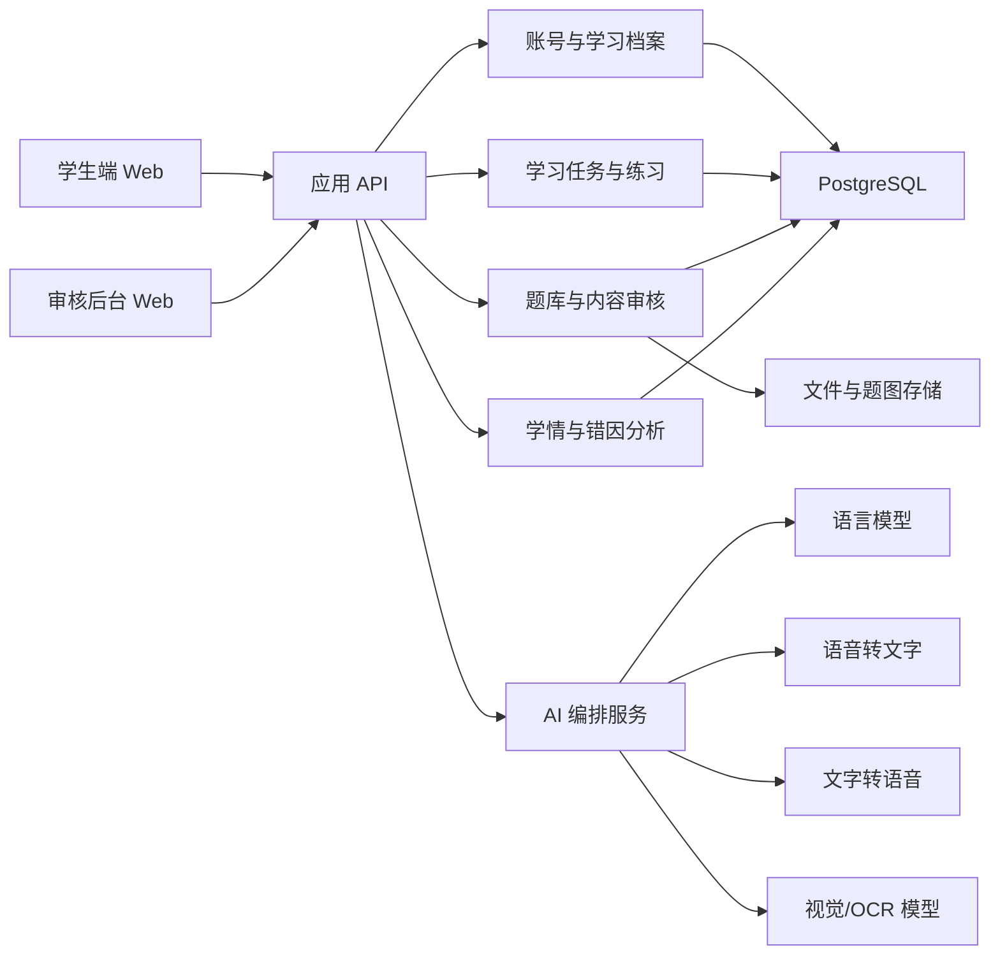
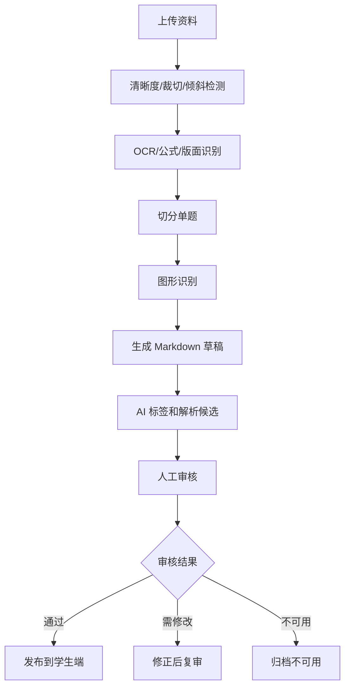

# 初中 AI 学习软件 MVP 技术方案

日期：2026-06-30

## 1. 阶段目标

本技术方案服务于一次函数 MVP 开发阶段。目标不是一次性建设完整教育平台，而是把已确认的产品设计和原型拆成可开发、可验证、可迭代的系统边界。

MVP 优先跑通：

1. 学生账号、目标分数和学习档案。
2. 一次函数诊断、任务推荐、学习任务、练习、错题复练和学情报告。
3. AI 教练在当前题目和当前任务内的多轮追问。
4. 文字和语音双通道交互。
5. 题库 Markdown 入库、半自动识别、人工审核、发布控制。
6. 一次函数图像交互和图形识别审核流程。

暂不进入全量三科、家长端、老师班级管理、支付、复杂几何自动理解和拍照手写批改。

## 2. 推荐技术栈

### 前端

- Web 框架：React + Vite。
- UI 实现：CSS Modules 或普通 CSS 起步，后续可引入组件库，但 MVP 先保持轻量。
- 图像交互：SVG 优先实现一次函数图像，避免过早引入复杂画布库。
- 音频交互：浏览器 `MediaRecorder` 录音，服务端转写；TTS 音频以 URL 或流式音频返回。

### 后端

- API 服务：Node.js + Fastify 或 NestJS。若团队偏好 Python AI 编排，也可用 FastAPI，但账号、题库和任务接口建议保持统一服务边界。
- 数据库：PostgreSQL。
- 文件存储：本地对象存储兼容层起步，后续迁移到 S3/R2/OSS。
- 队列：MVP 可用数据库任务表；题库 OCR、图形识别、AI 标签补全等离线任务后续接 BullMQ/Redis。

### AI 与文档处理

- 实时 AI 教练：低延迟模型，按复杂度升级。
- 诊断、报告、题库处理：结构化输入输出，模型 + 规则混合。
- OCR/版面/视觉识别：优先接成熟服务或视觉模型，不自研底层识别。
- STT/TTS：独立封装为语音服务适配层，避免散落在业务代码里。

## 3. 系统边界

核心原则：

- 学生端只消费已发布内容；未审核题目、低置信度图形识别结果不能进入学生正式讲解。
- AI 输出尽量基于结构化上下文：题目、学生答案、步骤、提示次数、错因候选、审核状态。
- 题库处理是离线流程；学生答疑是实时流程，二者使用不同质量门槛。
- 当前题目内做强上下文，跨题长期记忆先只保留基础学习档案。

## 4. 核心领域模型

### 用户与学习档案

- `users`：账号、角色、登录方式。
- `student_profiles`：年级、地区、目标分数、当前阶段。
- `learning_plans`：阶段计划、推荐模块、计划状态。
- `student_module_states`：模块状态、掌握度、最近诊断时间。

### 内容与题库

- `content_units`：一次函数知识单元、生活场景、引导问题、例题、小练习。
- `questions`：题干、题型、答案、解析、审核状态、发布状态。
- `question_options`：选择题选项。
- `question_tags`：知识点、能力类型、难度、错因候选。
- `question_assets`：题图、原始截图、PDF 区域图。
- `figure_recognitions`：图形类型、识别元素、置信度、审核状态。
- `import_jobs`：导入任务、文件来源、识别状态、失败原因。
- `import_items`：切分后的单题草稿、Markdown 草稿、识别质量。

### 学习任务与练习

- `diagnostic_sessions`：初始诊断和模块小诊断。
- `diagnostic_answers`：诊断题作答、置信度、能力表现。
- `learning_tasks`：推荐任务、任务类型、预计时长、完成标准。
- `task_steps`：生活场景、概念讲解、交互图像、例题、练习、复盘。
- `practice_sessions`：练习会话、题目列表、完成状态。
- `student_answers`：最终答案、过程步骤、语音转写、提交时间。
- `mistake_records`：错题、错因、证据、复练状态。

### AI 与语音

- `ai_conversations`：任务或题目内的对话会话。
- `ai_messages`：角色、内容、模式、关联题目、关联任务。
- `ai_events`：提示、讲解、答案模式、模型调用、失败记录。
- `voice_transcripts`：音频文件、转写文本、确认状态。
- `tts_outputs`：讲解文本、音频地址、播放参数。

## 5. API 切分

学生端 API：

- `POST /auth/login`：登录。
- `GET /student/profile`：学习档案。
- `PUT /student/profile/goal`：设置目标分数。
- `POST /diagnostics/initial/start`：开始初始诊断。
- `POST /diagnostics/:sessionId/answers`：提交诊断答案。
- `GET /tasks/today`：获取今日任务。
- `GET /modules/linear-function`：一次函数模块状态。
- `POST /modules/linear-function/diagnostic/start`：开始模块小诊断。
- `POST /tasks/:taskId/start`：开始学习任务。
- `POST /practice/:sessionId/answers`：提交练习答案。
- `POST /ai/conversations/:conversationId/messages`：当前任务或题目内追问。
- `POST /voice/stt`：上传语音并转写。
- `POST /voice/tts`：生成 AI 讲解音频。
- `GET /reports/latest`：最新学情报告。

后台 API：

- `POST /admin/import-jobs`：上传 Word/PDF/图片/Markdown。
- `GET /admin/import-jobs/:jobId`：查看导入任务。
- `GET /admin/questions/review`：待审核题目列表。
- `PUT /admin/questions/:questionId`：编辑结构化题目。
- `POST /admin/questions/:questionId/approve`：审核通过。
- `POST /admin/questions/:questionId/reject`：标记需修改或不可用。
- `GET /admin/figure-recognitions/review`：图形识别审核列表。
- `PUT /admin/figure-recognitions/:id`：修正识别字段。
- `POST /admin/publish`：发布审核通过内容。

## 6. AI Agent 编排

### 实时学习链路

学习教练 Agent：

- 输入：当前任务、题目、学生答案、步骤、历史提示、学生水平、模式。
- 输出：提示、讲解、答案、追问或相似题建议。
- 质量规则：未提交前默认提示模式；多次求助先要求学生说明当前想法；不确定时明确说明。

诊断 Agent：

- 输入：诊断答案、能力标签、题目难度、作答置信度。
- 输出：能力表现、薄弱点、错因候选。
- 质量规则：不能只按对错判断，必须结合步骤、提示次数、是否查看答案。

任务推荐 Agent：

- 输入：学习档案、诊断结果、练习表现、目标分数。
- 输出：任务类型、推荐原因、预计时长、完成标准。
- 质量规则：每次推荐只突出一个主目标，避免堆任务。

报告生成 Agent：

- 输入：结构化学情数据、错因分布、最近任务表现。
- 输出：学生可读的简明反馈和下一步任务。
- 质量规则：先讲具体进步，再讲薄弱点，最后给可执行任务。

### 离线内容链路

题库处理 Agent：

- 输入：OCR 文本、版面切分、原始图片/PDF 区域。
- 输出：Markdown 草稿、结构化题目字段、标签候选。
- 质量规则：草稿必须进入待审核，不直接发布。

图形识别 Agent：

- 输入：题图或 PDF 区域图。
- 输出：图形类型、点线截距交点刻度等结构化元素、置信度。
- 质量规则：低置信度只进入后台审核，不用于学生讲解。

内容审核辅助 Agent：

- 输入：题目、答案、解析、标签、图形识别结果。
- 输出：一致性风险、低置信度字段、需人工确认点。
- 质量规则：只辅助审核，不替代老师最终判断。

## 7. 题库导入与审核流程

审核状态：

- `pending_recognition`：待识别。
- `recognition_failed`：识别失败。
- `pending_review`：待审核。
- `needs_revision`：需修改。
- `approved`：审核通过。
- `published`：已发布。
- `unusable`：不可用。

发布规则：

- 题目、答案、解析、标签、图形识别结果都通过审核后才能发布。
- 图形识别结果低于置信度阈值时，后台可以保存，但学生端讲解必须忽略该识别结果。
- Markdown 入库保留原文和修订记录，便于追溯。

## 8. MVP 开发切分

建议拆成 5 条可独立推进的开发流：

1. 学生学习闭环前端：登录入口、目标设置、今日任务、一次函数任务页、练习、复盘、报告。
2. 学习业务后端：账号、学习档案、诊断、任务、练习、错题、报告数据。
3. AI 编排服务：学习教练、诊断、任务推荐、报告生成、STT/TTS 接口。
4. 题库与审核后台：导入任务、Markdown 草稿、题目审核、图形识别审核、发布控制。
5. 验证与内容样例：一次函数首批样例内容、端到端测试、AI 行为检查、视觉和移动端 QA。

开发顺序：

1. 先做无 AI 真实调用的端到端闭环，用 mock AI 输出跑通数据结构。
2. 接入学习教练和诊断 Agent，限定在一次函数任务和当前题目上下文。
3. 接入题库导入与审核后台，先支持 Markdown，再扩展 PDF/图片半自动转换。
4. 接入语音转写和 TTS 播放，确保文字版本始终可见。
5. 做整体验证和小范围试用准备。

## 9. 验证策略

### 自动化验证

- 单元测试：错因规则、任务推荐规则、题目状态流转、图形识别置信度门槛。
- API 测试：学生主流程、后台审核流程、发布控制。
- 前端测试：任务时长切换、图像交互、提示/讲解/答案模式切换、语音按钮状态。
- 集成测试：诊断 -> 推荐任务 -> 练习 -> 错因 -> 报告 -> 下一步任务。

### 人工验证

- 学生是否知道今天学什么。
- 推荐理由是否清楚。
- 做错后是否知道错因和下一步。
- AI 是否默认提示而不是直接给答案。
- 语音输入是否保留文字转写。
- 未审核题目是否无法发布到学生端。
- 低置信度图形识别是否被挡在后台。

## 10. 主要风险

- AI 过度自由发挥：用模板、结构化上下文和审核状态约束。
- 题库导入质量不稳定：先支持 Markdown 和人工审核，再扩展 OCR 自动化。
- 图形识别误用：低置信度结果不得进入学生讲解。
- 学习闭环过大：第一版只做一次函数，不扩展其他学科。
- 语音喧宾夺主：题目、公式、图像和步骤始终可视化展示。
- 报告过度数据化：学生端只展示少量可行动信息，详细数据给后台和 AI。

## 11. 下一步

1. 写 MVP 开发切分计划，明确每条开发流的文件、接口和验收命令。
2. 先实现学生学习闭环的可运行骨架，再接后端数据。
3. 建立一次函数样例题库和审核状态种子数据。
4. 用 mock AI 跑通提示、讲解、答案、诊断和报告输出模板。
5. 完成端到端验证后再接入真实模型、OCR、STT 和 TTS。
