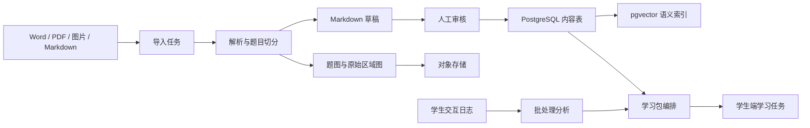

# 数据管线与系统进化技术方案

日期：2026-07-07

## 1. 背景

本方案吸收 `E:\middle审查\修复与数据管理计划.md` 中适合当前项目阶段的建议，用于补齐一次函数 MVP 后续的内容入库、PDF 资料管理、语义检索、学习行为数据和系统进化机制。

当前项目已经具备：

- 学生端一次函数学习闭环原型。
- Fastify API 骨架。
- 账号、学习档案、诊断、任务、练习、错题、AI 对话基础 schema。
- Markdown 题目导入、题目审核、图形识别审核、发布控制基础 schema。

本方案不替代已有 MVP 技术方案，而是作为下一阶段“数据与内容底座”的补充设计。

## 2. 采纳结论

### 2.1 采纳

1. PostgreSQL + pgvector + 对象存储作为内容与检索底座。
2. Markdown 作为题库和知识内容的审核中间格式。
3. PDF 解析采用“通用解析优先，公式识别兜底”的管线。
4. 内容单元按题目、例题、知识讲解、生活场景等语义单元切分，而不是按页切分。
5. 交互日志作为后续个性化推荐、题目质量评估和提示策略优化的数据源。
6. Obsidian 只作为可选教师审核辅助界面，不作为主存储。

### 2.2 暂不采纳

1. 立即引入完整自动进化机制。MVP 先记录数据，分析和自动优化后置。
2. 立即接入 Docling、Mathpix、pgvector、MinIO、BullMQ 的全套生产链路。先设计接口和 schema，再逐步接入。
3. 用 Obsidian 替代后台审核。当前后台审核仍是主路径。
4. 直接套用审查意见中针对 `prototype-fresh-study-tool/src/App.jsx` 的修复项。当前主线已转到 `apps/student-web`。

## 3. 目标架构



## 4. 数据分层

### 4.1 主数据库

PostgreSQL 继续作为唯一业务事实来源，承载：

- 用户与学习档案。
- 题库和内容审核状态。
- 题图和原始资料引用。
- 学生练习、错题、AI 对话和语音记录。
- 交互日志和报告生成输入。

### 4.2 语义检索

pgvector 作为 PostgreSQL 扩展使用，不单独引入外部向量数据库。检索对象包括：

- 题干。
- 解析。
- 知识讲解。
- 生活场景。
- 错因说明。

第一版只做离线向量化和后台检索验证；学生端推荐仍以规则和标签为主。

### 4.3 对象存储

对象存储保存不可直接放入关系表的大文件：

- 原始 PDF、Word、扫描图片。
- OCR 页面截图。
- 单题切分区域图。
- 题图、公式图、坐标系图。
- 语音输入原始音频。
- TTS 输出音频。

本地开发可用 MinIO 或文件系统兼容适配层，生产环境迁移到 S3/R2/OSS。

## 5. 推荐 Schema 扩展

现有 `services/api/src/db/schema.sql` 和 `services/api/src/db/content-schema.sql` 保持不破坏，新增扩展表优先放到独立迁移文件，例如：

```text
services/api/src/db/data-pipeline-schema.sql
```

### 5.1 来源文档

```sql
CREATE TABLE source_documents (
  id TEXT PRIMARY KEY,
  filename TEXT NOT NULL,
  title TEXT,
  subject TEXT NOT NULL DEFAULT '数学',
  grade TEXT,
  module TEXT,
  file_url TEXT NOT NULL,
  status TEXT NOT NULL CHECK (status IN (
    'pending',
    'parsing',
    'parsed',
    'parse_failed',
    'reviewing',
    'archived'
  )),
  page_count INTEGER,
  uploaded_by TEXT REFERENCES users(id),
  created_at TEXT NOT NULL
);
```

### 5.2 内容单元

`questions` 表继续承载发布给学生的题目；`content_units` 表承载更细粒度的知识、例题、场景和未发布内容。

```sql
CREATE TABLE content_units (
  id TEXT PRIMARY KEY,
  document_id TEXT REFERENCES source_documents(id),
  question_id TEXT REFERENCES questions(id),
  chunk_type TEXT NOT NULL CHECK (chunk_type IN (
    'concept',
    'example',
    'problem',
    'scenario',
    'explanation'
  )),
  content_markdown TEXT NOT NULL,
  knowledge_tags_json TEXT NOT NULL,
  difficulty TEXT CHECK (difficulty IN ('基础', '提升', '冲刺')),
  ability TEXT CHECK (ability IN ('概念', '表达式', '图像', '应用', '综合')),
  error_types_json TEXT NOT NULL,
  review_status TEXT NOT NULL CHECK (review_status IN (
    'pending_review',
    'needs_revision',
    'approved',
    'rejected'
  )),
  quality_score REAL NOT NULL DEFAULT 1.0,
  usage_count INTEGER NOT NULL DEFAULT 0,
  created_at TEXT NOT NULL,
  updated_at TEXT NOT NULL
);
```

### 5.3 知识图谱

```sql
CREATE TABLE knowledge_points (
  id TEXT PRIMARY KEY,
  name TEXT NOT NULL UNIQUE,
  module TEXT NOT NULL,
  description TEXT NOT NULL,
  parent_id TEXT REFERENCES knowledge_points(id)
);

CREATE TABLE knowledge_edges (
  source_id TEXT NOT NULL REFERENCES knowledge_points(id),
  target_id TEXT NOT NULL REFERENCES knowledge_points(id),
  relation_type TEXT NOT NULL CHECK (relation_type IN (
    'prerequisite',
    'related',
    'contrasted'
  )),
  strength REAL NOT NULL DEFAULT 1.0,
  PRIMARY KEY (source_id, target_id, relation_type)
);
```

### 5.4 交互日志

```sql
CREATE TABLE interaction_logs (
  id TEXT PRIMARY KEY,
  student_id TEXT NOT NULL REFERENCES users(id),
  task_id TEXT REFERENCES learning_tasks(id),
  question_id TEXT,
  content_unit_id TEXT REFERENCES content_units(id),
  action TEXT NOT NULL CHECK (action IN (
    'view_content',
    'submit_answer',
    'request_hint',
    'view_explanation',
    'view_full_answer',
    'voice_input',
    'rate_ai_response'
  )),
  student_answer TEXT,
  hint_level INTEGER NOT NULL DEFAULT 0,
  time_to_answer_ms INTEGER,
  correct INTEGER CHECK (correct IN (0, 1)),
  ai_response TEXT,
  feedback_rating INTEGER CHECK (feedback_rating BETWEEN 1 AND 5),
  created_at TEXT NOT NULL
);
```

### 5.5 Prompt 模板

```sql
CREATE TABLE prompt_templates (
  id TEXT PRIMARY KEY,
  scenario TEXT NOT NULL,
  version INTEGER NOT NULL DEFAULT 1,
  template TEXT NOT NULL,
  is_active INTEGER NOT NULL CHECK (is_active IN (0, 1)),
  created_at TEXT NOT NULL
);
```

## 6. PDF 与资料解析管线

第一阶段不追求全自动，而是建立可审核的半自动链路。

1. 上传资料，生成 `source_documents` 和 `import_jobs`。
2. 对 PDF 或图片执行清晰度、裁切完整性、页数和文件类型检查。
3. 使用通用解析器生成 Markdown 草稿和页面结构。
4. 对低置信度公式区域调用公式识别兜底服务。
5. 按题号、选项、答案、解析、图形区域切分内容。
6. 题图和原始区域图保存到对象存储。
7. 生成 `content_units` 和 `questions` 草稿。
8. AI 补充知识点、能力、难度、错因候选。
9. 后台人工审核后发布。

## 7. 动态学习包编排

编排引擎不直接让 AI 临时发挥，而是组合已审核内容。

输入：

- 学生目标分数。
- 当前模块状态。
- 诊断结果。
- 最近练习正确率。
- 错因分布。
- 可用的审核通过内容单元。

输出：

- 概念补习内容。
- 生活化场景。
- 例题拆解。
- 分层练习。
- 错题复练。
- 下一步任务。

第一版排序规则：

1. 必须是审核通过内容。
2. 优先匹配当前知识点。
3. 优先匹配学生主要错因。
4. 难度按目标分数和最近表现选择。
5. 同类内容按质量分高、使用次数低优先。

## 8. 系统进化机制

### 8.1 MVP 阶段只记录数据

MVP 先记录以下数据，不自动改推荐策略：

- 学生提交答案。
- 是否正确。
- 请求提示次数。
- 是否查看完整答案。
- AI 讲解内容。
- 学生语音转写。
- 答题耗时。
- 学生对 AI 回复评分。

### 8.2 后续批处理分析

后续每日或每周批处理：

- 计算题目正确率。
- 计算查看解析后的同类题通过率。
- 识别高频错因。
- 识别低质量题目或解析。
- 统计不同提示层级对正确率的影响。
- 更新内容质量分和知识边关系强度。

### 8.3 人工审核仍是质量闸门

自动分析只能标记候选问题，不能直接发布、下架或改写正式内容。所有影响学生正式学习内容的改动必须经过后台审核。

## 9. Obsidian 定位

Obsidian 不进入主链路，不作为数据库，不作为发布系统。

可选定位：

- 教师离线审阅 Markdown 草稿。
- 教研人员批量补充知识点关联。
- 小规模内容试制阶段的临时协作工具。

限制：

- 无并发控制。
- 无正式权限模型。
- 无稳定业务 API。
- 难以承载题目状态流转和发布审计。

因此，后台审核页面仍是正式审核入口。

## 10. 实施顺序

1. 先扩展数据设计文档和迁移文件，不接真实解析服务。
2. 用 Markdown 样例模拟 `source_documents`、`content_units`、`interaction_logs`。
3. 在 API 中增加内容单元、知识点、交互日志的最小 CRUD 或写入接口。
4. 后台增加内容单元审核视图。
5. 学生端练习提交和 AI 求助写入交互日志。
6. 再接入 PDF 解析和对象存储。
7. 最后接 pgvector、质量分批处理和 Obsidian 同步。

## 11. 验收标准

第一阶段完成时应满足：

- 能记录一份来源文档。
- 能从 Markdown 样例生成内容单元草稿。
- 能审核内容单元并关联到题目。
- 能记录学生一次答题和一次 AI 求助日志。
- 学情报告可以从结构化日志读取关键数据。
- 未审核内容不能进入学生端正式学习任务。

## 12. 风险与约束

- 不要在 MVP 阶段同时引入过多基础设施。
- 不要让 AI 生成内容绕过人工审核。
- 不要把 Obsidian 设计成正式数据库。
- 不要把语义检索作为第一版推荐的唯一依据。
- 不要用 PDF 页码作为核心内容单元边界。
